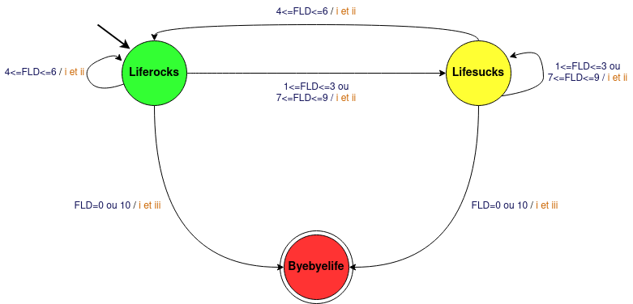

# Projet_INF203

## 1 - Préliminaires

## 2 - Bash

## 3 - C

## 4 - Automates

### Automate



### tamagoshi.cow

1. Fonction affiche :
```c
void affiche_vache(int etat){
    /* Déclaration des yeux et de la langue */
    char yeux[3];
    char langue[2];

    /* Dépendamment de l'état actuel on modifie les yeux et la langue*/
    switch (etat)
    {
    case byebyelife:
        strcpy(yeux,"XX\0");
        strcpy(langue,"U\0");
        break;
    case lifesucks:
        strcpy(yeux,"--\0");
        strcpy(langue," \0");
        break;
    case liferocks:
        strcpy(yeux,"OO\0");
        strcpy(langue," \0");
        break;
    }

    /* On crée la vache de base qui "prend en paramètre" les yeux et la langue*/
    char vache[1000] = "          ^ __ ^\n           (%s)\\_______\n           (__)\\       )\\/\\\n   O         %s ||----w |\n  \\|/          ||     ||             \\|/\n^^^^^^^^^^^^^^^^^^^^^^^^^^^^^^^^^^^^^^^^^^^^^^^^\n";
    
    /* On affiche la vache avec les yeux et la langue modifiés */
    printf(vache, yeux, langue);
}
```

2. **Variables globales**
On créé les variables globales en dehors de toute fonction :
```c
int fitness = 5;
int stock = 5;
```

3. **Routines stock_update() et fitness_update()**
- stock_update :
```c
void stock_update(int lunchfood){
    /* On initialise le generateur de nombres aleatoires */
    time_t t ;
    srand (( unsigned ) time (& t ) ) ;

    /*On génère un nombre entre -3 et 3 inclus*/
    int crop = (rand() % 8) - 3;
    stock = stock + crop - lunchfood;

    /*Notre stock doit obligatoirement être en 0 et 10 inclus*/
    if (stock<0){
        stock = 0;
    }
    else if (stock>10){
        stock = 10;
    }
}
```
- fitness_update :
```c
void fitness_update(int lunchfood){
    /* On initialise le generateur de nombres aleatoires */
    time_t t ;
    t = t + 12232;
    srand((unsigned)time(&t));

    /*On génère un nombre entre -3 et 0 inclus*/
    int digestion = (rand() % 4) - 3;
    fitness = fitness + digestion + lunchfood;
    
    /*Notre stock doit obligatoirement être en 0 et 10 inclus*/
    if (fitness<0){
        fitness = 0;
    }
    else if (fitness>10){
        fitness= 10;
    }
}
```

4. **Fonction main :**
```c
int main(){
    /*Initialisation de variable */
    int lunchfood;
    int dureedevie = 0;
    int etat = 2;

    /*Boucle qui va vérifier que la vache n'est pas morte et qui compte sa durée de vie*/
    while (etat != byebyelife)
    {
        /*affiche l'état courant de la vache en la dessinant*/
        affiche_vache(etat);

        /*On affiche le stock restant et on demande de rentrer
        une valeur de lunchfood qui doit être compris entre le stock et 0 compris*/ 
        printf("stock : %d\n", stock);
        printf("lunchfood? : ");
        scanf("%d", &lunchfood);
        while (lunchfood>stock || lunchfood<0){
            printf("Veuillez entrer une valeur entre 0 et %d.\n    lunchfood? : ", stock);
            scanf("%d", &lunchfood);
        }
        
        /* On met à jour les valeurs du stock et du fitness et selon 
        la valeur du fitness la vache change d'état et nous refaisons cette boucle 
        tant que la vache ne soit pas dans l'état byebyelife et si ce n'est pas le cas, on ajoute un à la durée de vie*/
        stock_update(lunchfood);
        fitness_update(lunchfood);
        if (fitness == 0 || fitness == 10){
            etat = byebyelife;
        }else if (fitness == 1 || fitness == 2 || fitness == 3 || fitness == 7 || fitness == 8 || fitness == 9){
            etat = lifesucks;
        }else if (fitness == 4 || fitness == 5 || fitness == 6){
            etat = liferocks;
        }
        dureedevie = dureedevie + 1;
        printf("______________________________________________________________________________________________\n\n");
    }
    /*Lorsque la partie est finie, on affiche la vache morte et on conclu avec une phrase et son age*/
    affiche_vache(etat);
    printf("Vous avez perdu, votre vache avait %d ans\n",dureedevie);
    return 0;
}
```


