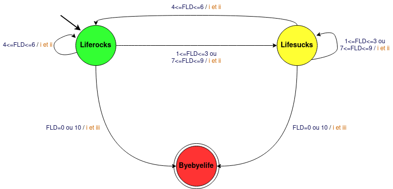

# Projet_INF203

## 1 - Préliminaires
### Options :
- -b :
- -d : affiche une vache morte.
- -g :
- -p :
- -t : affiche une vache fatiguée.
- -y :
- -W : nécessite un entier en argument suivant. Cet entier est le nombre de caractères maximum que peux contenir une ligne de texte dans la bulle de parole de la vache.
- -e : nécessite une chaîne de deux caractères après qui remplacera les yeux de base de la vache (OO).
- -T : nécessite une chaîne de deux caractères après qui deviendra la de la vache.
- -f : permet de spécifier le nom du fichier qui sera utilisé pour trouver le dessin de la vache.
- -r : affiche une vache choisie aléatoirement dans le répertoire COWPATH.
- -c :
- -l : affiche l'ensemble des "dessins" de vache qui se trouve dans le répertoire COWPATH.
- -h : affiche une aide pour l'utilisation de la commande cowsay.


## 2 - Bash

Dans toute la partie bash, nos programmes commencent par ``` #!/bin/bash ``` pour que notre fichier soit bien un fichier bash.

### cow_kindergarten
```c
#!/bin/bash
#boucle qui sera répétée 10 fois
for i in {1..10}
do
#la vache dira la valeur que i aura
cowsay $i
#pause de 1 seconde
sleep 1
done
#la vache tire la langue
cowsay -T "U " meuh
```

Dans cette fonction, la vache prononce les chiffres de 1 a 10 avec une pause d’une seconde entre chaque chiffre. Elle tire la langue lorsque la boucle est terminée.

Exemple d'éxécution :
```c
 ___
< 1 >
 ---
        \   ^__^
         \  (oo)\_______
            (__)\       )\/\
                ||----w |
                ||     ||
 ___
< 2 >
 ---
        \   ^__^
         \  (oo)\_______
            (__)\       )\/\
                ||----w |
                ||     ||
 ___
< 3 >
 ---
        \   ^__^
         \  (oo)\_______
            (__)\       )\/\
                ||----w |
                ||     ||
 ___
< 4 >
 ---
        \   ^__^
         \  (oo)\_______
            (__)\       )\/\
                ||----w |
                ||     ||
 ___
< 5 >
 ---
        \   ^__^
         \  (oo)\_______
            (__)\       )\/\
                ||----w |
                ||     ||
 ___
< 6 >
 ---
        \   ^__^
         \  (oo)\_______
            (__)\       )\/\
                ||----w |
                ||     ||
 ___
< 7 >
 ---
        \   ^__^
         \  (oo)\_______
            (__)\       )\/\
                ||----w |
                ||     ||
 ___
< 8 >
 ---
        \   ^__^
         \  (oo)\_______
            (__)\       )\/\
                ||----w |
                ||     ||
 ___
< 9 >
 ---
        \   ^__^
         \  (oo)\_______
            (__)\       )\/\
                ||----w |
                ||     ||
 ____
< 10 >
 ----
        \   ^__^
         \  (oo)\_______
            (__)\       )\/\
                ||----w |
                ||     ||
 ______
< meuh >
 ------
        \   ^__^
         \  (oo)\_______
            (__)\       )\/\
             U  ||----w |
                ||     ||
```


### cow_primaryschool
```c
#!/bin/bash
#boucle qui sera répétée n fois
for i in $(eval echo {1..$1})
do
#La vache dira la valeur que i aura
cowsay $i
#pause de 1 seconde
sleep 1
done
#la vache tire la langue
cowsay -T "U " meuh
```
La vache prononce les chiffres de 1 a n avec n un nombre donné en argument.
Lors de la réalisation de cette fonction, nous avons mis du temps à comprendre que lorsque nous voulions utilisé des valeurs non fixes c'est-à-dire pas des nombres, nous devions mettre ```$(eval echo )``` avant la variable.

Exemple d'éxécution :
arguments : 2
```c
 ___
< 1 >
 ---
        \   ^__^
         \  (oo)\_______
            (__)\       )\/\
                ||----w |
                ||     ||
 ___
< 2 >
 ---
        \   ^__^
         \  (oo)\_______
            (__)\       )\/\
                ||----w |
                ||     ||
 ______
< meuh >
 ------
        \   ^__^
         \  (oo)\_______
            (__)\       )\/\
             U  ||----w |
                ||     ||
```

### cow_highschool
```c
#!/bin/bash
#boucle répétée n fois 
for i in $(eval echo {1..$1})
do
#la vache prononcera la multiplication des deux mêmes chiffres donc le carré
cowsay $(expr $i \* $i)
#pause de 1 seconde
sleep 1
done
#vache qui tire la langue
cowsay -T "U " meuh
```
Cette vache pourra dire les carrés des chiffres ou nombres qui se trouvent entre 1 et n avec n qui sera donné en argument. 
Lors de la réalisation de ce programme, nous ne comprenions pas pourquoi on ne pouvait pas juste marqué ```cowsay $i*$i```. Nous avons ensuite vu dans le cours que lorsque nous voulions faire des opérations sur des valeurs de variables, nous devons mettre ```$(expr )``` et que nous devions aussi mettre un ```\``` devant le ```*``` pour qu'il soit pris pour un opérateur. 

Exemple d'éxécution :
argument : 3
```c
 ___
< 1 >
 ---
        \   ^__^
         \  (oo)\_______
            (__)\       )\/\
                ||----w |
                ||     ||
 ___
< 4 >
 ---
        \   ^__^
         \  (oo)\_______
            (__)\       )\/\
                ||----w |
                ||     ||
 ___
< 9 >
 ---
        \   ^__^
         \  (oo)\_______
            (__)\       )\/\
                ||----w |
                ||     ||
 ______
< meuh >
 ------
        \   ^__^
         \  (oo)\_______
            (__)\       )\/\
             U  ||----w |
                ||     ||
```

### cow_college 

La suites de Fibonacci est une suite de nombre tel que ses deux premiers termes sont 0 et 1, et ensuite, chaque terme successif est la somme des deux termes précédents. Ainsi 0+1=1, 1+1=2, 1+2=3, 2+3=5, 3+5=8, etc.

```c
#!/bin/bash
#initialisation des deux premier termes
u0=0
u1=1
#premier termes calculé
cowsay zero
sleep 1
cowsay $u1
sleep 1
un1=$u1
un2=$u0
u=$(expr $un1 + $un2)
#calcul des autres termes jusqu a la fin
while [ $u -le $1 ]
do
cowsay $u
sleep 1
un2=$un1
un1=$u
u=$(expr $un1 + $un2)
done
#vache tire la langue
cowsay -T "U " meuh
```
Dans notre programme, nous avons d'abord initialisé les deux premiers termes à 0 et 1. Ensuite nous affichons le premier terme qui est zéro. Cependant, on peut remarquer que l'on affiche zéro en lettre et ce n'est pas la valeur de u0 car lorsque nous mettions cela, le programme affichait zéro et ne continuait pas la suite. Nous avons donc trouvé cette alternative. Ensuite nous affichons la valeur de u1 puis nous changeons les valeurs, c'est-à-dire que notre u2 aura comme valeur 0 et u1 restera à 1. Puis nous initialisons u à la valeur de u1+u2 et nous échangeons dans la boucle jusqu'à tomber sur le nombre donné en argument.

Exemple d'éxécution :
argument : 5
```c
 ______
< zero >
 ------
        \   ^__^
         \  (oo)\_______
            (__)\       )\/\
                ||----w |
                ||     ||
 ___
< 1 >
 ---
        \   ^__^
         \  (oo)\_______
            (__)\       )\/\
                ||----w |
                ||     ||
 ___
< 1 >
 ---
        \   ^__^
         \  (oo)\_______
            (__)\       )\/\
                ||----w |
                ||     ||
 ___
< 2 >
 ---
        \   ^__^
         \  (oo)\_______
            (__)\       )\/\
                ||----w |
                ||     ||
 ___
< 3 >
 ---
        \   ^__^
         \  (oo)\_______
            (__)\       )\/\
                ||----w |
                ||     ||
 ___
< 5 >
 ---
        \   ^__^
         \  (oo)\_______
            (__)\       )\/\
                ||----w |
                ||     ||
 ______
< meuh >
 ------
        \   ^__^
         \  (oo)\_______
            (__)\       )\/\
             U  ||----w |
                ||     ||
```

### cow_university
```c
#!/bin/bash
j=1
#prononce le premier nombre premier
cowsay 2
sleep 1
#boucle pour aller jusqu a la valeur en argument
while [ $j -le $1 ]
do
if [ $j -gt 1 ]
then
estPremier=1 
for i in $(eval echo {2..$(expr 1 + $(expr $j / 2 ))})
do
#condition pour être un nombre premier
if [ $(expr $j % $i) -eq 0 ]
then
estPremier=0
fi
done
fi
#affichage du nombre si il est premier
if [[ $estPremier -eq 1 ]]
then
cowsay $j
sleep 1
fi
#itération pour ne pas etre dans une boucle infinie
j=$(expr $j + 1)
done
cowsay -T "U " meuh
```
Dans ce programme nous avons d'abord affiché la valeur du 2 car c'est un nombre premier cependant elle ne s'affiche pas avec les boucles que nous avaons faites car elle ne respecte pas les conditions. 
Ensuite, nous commencé une boucle pour que le prgramme s'arrête à la valeur demandé c'est-à-dire que le programme doit s'arrêter avant que la valeur en argument soit dépassée. Ensuite grâce à plusieurs conditions, on vérifie ou non si le chiffre est un nomre premier et si oui on l'affiche. 

Exemple d'éxécution :
argument : 4
```c
 ___
< 2 >
 ---
        \   ^__^
         \  (oo)\_______
            (__)\       )\/\
                ||----w |
                ||     ||
 ___
< 3 >
 ---
        \   ^__^
         \  (oo)\_______
            (__)\       )\/\
                ||----w |
                ||     ||
 ______
< meuh >
 ------
        \   ^__^
         \  (oo)\_______
            (__)\       )\/\
             U  ||----w |
                ||     ||
```


### smart_cow 
```c
#!/bin/bash
#on decoupe chaque partie de l agument pour récuperer les deux chiffres et l opérateur
n1=$(echo $1 | cut -c1 )
n2=$(echo $1 | cut -c3)
operateur=$(echo $1 | cut -c2)

#en fonction de l operateur on adapte le calul a faire
if [ $operateur = "+" ]
then
resultat=$(expr $n1 + $n2)
elif [ $operateur = "-" ]
then
resultat=$(expr $n1 - $n2)
elif [ "$operateur" = "*" ]
then
resultat=$(expr $n1 \* $n2)
elif [ $operateur = "/" ]
then
resultat=$(expr $n1 / $n2)
elif [ $operateur = "%" ]
then
resultat=$(expr $n1 % $n2)
fi

#on met le résultat dans ses yeux et le calul dans sa bulle 
cowsay -e $resultat $1
sleep 1
cowsay -T \U meuh
```
Dans ce programme, nous récupérons d'abord le premier caractère qui sera la premier chiffre, le deuwième qui sera l'opérateur et le troisième qui sera le deuxième chiffre. Ensuite selon la valeur de l'opérateur on effectue le calcul et on met le résultat dasn les yeux de la vache.

Exemple d'éxécution :
argument : 2+3
```c
 _____
< 2+3 >
 -----
        \   ^__^
         \  (5)\_______
            (__)\       )\/\
                ||----w |
                ||     ||
 ______
< meuh >
 ------
        \   ^__^
         \  (oo)\_______
            (__)\       )\/\
             U ||----w |
               ||     ||
```

### crazy_cow 


## 3 - C

### new_cow

1. Fonction affiche :
```c
void affiche_vache(int argc, char *argv[]){
    /*On initialise les yeux et la langue en des caractères spécifiques ainsi qu'une vache */
    char yeux[3] = "OO\0";
    char langue[2] = " \0";
    char vache[1000] = "        \\ ^ __ ^\n         \\ (%s)\\_______\n           (__)\\       )\\/\\\n             %s ||----w |\n               ||     ||\n";
    
    /*Cette boucle va permettre de modifier la langue et les yeux en rentrant une option comme -T en argument
    avec le caractère par lequel on veut le remplacer on peut aussi le faire avec les yeux en suivant le même fonctionnement 
    mais à la place de -T on met -e*/
    for (int i = 0; i < argc; i++)
    {
        if (strcmp(argv[i],"-T")==0){
            if (argc > i+1){
                langue[0] = argv[i + 1][0];
            }else{
                printf("Il manque un argument après l'option -T.\n");
                exit(EXIT_FAILURE);
            }
        }
        if (strcmp(argv[i],"-e")==0){
            if (argc > i+1){
                yeux[0] = argv[i + 1][0];
                yeux[1] = argv[i + 1][1];
            }else{
                printf("Il manque un argument après l'option -e.\n");
                exit(EXIT_FAILURE);
            }
             
        }
        /*Et lorsqu'on lui donne -parle ainsi qu'un autre argument, alors la vache va dire l'argument apres -parle*/
        if (strcmp(argv[i],"-parle")==0){
            if (argc > i+1){
                printf(" ");
                for (int j = 0; j < 2+strlen(argv[i+1]); j++){
                    printf("-");
                }
                printf("\n< ");
                for (int j = 0;argv[i+1][j] != '\0'; j++){
                    printf("%c", argv[i+1][j]);
                }
                printf(" >\n ");
                for (int j = 0; j < 2+strlen(argv[i+1]); j++){
                    printf("-");
                }
                printf("\n");
            }else{
                printf("Il manque un argument après l'option -parle.\n");
                exit(EXIT_FAILURE);
            }
        }
    /*Cette boucle nous permet de faire danser notre vache et en reprenant la même 
    logique que précédemment, pour qu'elle danse il faut lui rentrer l'argument -danse 
    ainsi que le nombre de fois qu'elle effectura cette danse*/
    for (int i = 0; i <argc; i++){
        if (strcmp(argv[i], "-danse") == 0)
        {
            int nombre_tours = atoi(argv[i + 1]);
            for (int j = 0; j < nombre_tours-1; j++)
            {
                strcpy(vache, "                 /)  (\\\n            .~._((,\"\".))_.~,\n             `~.   %s   ,~'\n               / ,n~~n. \\\n              { { .__. } }\n               ) `~ %s~' (\n              /`-._  _.-'\\\n             /            \\\n           ,-X            X-.\n          /   \\          /   \\\n         (     )| |  | |(     )\n          \\   / | |  | | \\   /\n           \\_(.-( )--( )-.)_/\n           /_,\\ ) /  \\ ( /._\\\n               /_,\\  /._\\\n");
                printf(vache, yeux, langue);
                sleep(1);
                printf("\n");
                strcpy(vache, "                 /)  (\\\n            .-._((,~~.))_.-,\n             `-.   %s   ,-'\n               / ,n--n. \\\n       (`'\\   ( ( .__. ) )  /`')\n        `.'\"._ ) `- %s-' (_,\"`.'\n          \"._             _,\"\n             /            \\\n            (              )\n            (`-.__    __.-')\n             \\   /`--'\\   /\n              ) /      \\ (\n             /._\\      /_,\\\n");
                printf(vache, yeux, langue);
                printf("\n");
                sleep(1);
            }
            strcpy(vache, "                 /)  (\\\n            .~._((,\"\".))_.~,\n             `~.   %s   ,~'\n               / ,n~~n. \\\n              { { .__. } }\n               ) `~ %s~' (\n              /`-._  _.-'\\\n             /            \\\n           ,-X            X-.\n          /   \\          /   \\\n         (     )| |  | |(     )\n          \\   / | |  | | \\   /\n           \\_(.-( )--( )-.)_/\n           /_,\\ ) /  \\ ( /._\\\n               /_,\\  /._\\\n");
        }
    }
    }
    printf(vache, yeux, langue);
}
```
Dans cette fonction, nous avons décidé que l'utilisateur pouvait changer les yeux et la langue de la vache en entrant en argument "-e" pour changer les yeux avec un deuxième argument pour remplacer les yeux ou "-T" pour la langue avec aussi un deuxième argument pour la remplacer. 
Nous avons également décidé de faire en sorte qu'elle puisse parler. Pour cela nous avons du nous même créer la bulle dans lequel le message qu'elle dira apparaitra. Ce message est d'ailleurs l'argument qui sera rentré par l'utilisateur.
Nous pouvons ensuite la faire danser en suivant la même syntaxe pour les arguments mais en mettant -danse et le nombre de fois qu'elle fera la danse. 

1.1 Exemples d'éxécution : 
- changer les yeux :
arguments : -e vv 
```c
        \ ^ __ ^
         \ (vv)\_______
           (__)\       )\/\
               ||----w |
               ||     ||
```

- changer de langue :
arguments : -T W 
```c
        \ ^ __ ^
         \ (OO)\_______
           (__)\       )\/\
             W ||----w |
               ||     ||
```

- parler : 
arguments : -parle bonjour 
```c
 ---------
< bonjour >
 ---------
        \ ^ __ ^
         \ (OO)\_______
           (__)\       )\/\
               ||----w |
               ||     ||
```

- danser : 
arguments : -danse 2 
```c
                 /)  (\
            .~._((,"".))_.~,
             `~.   OO   ,~'
               / ,n~~n. \
              { { .__. } }
               ) `~  ~' (
              /`-._  _.-'\
             /            \
           ,-X            X-.
          /   \          /   \
         (     )| |  | |(     )
          \   / | |  | | \   /
           \_(.-( )--( )-.)_/
           /_,\ ) /  \ ( /._\
               /_,\  /._\

                 /)  (\
            .-._((,~~.))_.-,
             `-.   OO   ,-'
               / ,n--n. \
       (`'\   ( ( .__. ) )  /`')
        `.'"._ ) `-  -' (_,"`.'
          "._             _,"
             /            \
            (              )
            (`-.__    __.-')
             \   /`--'\   /
              ) /      \ (
             /._\      /_,\

                 /)  (\
            .~._((,"".))_.~,
             `~.   OO   ,~'
               / ,n~~n. \
              { { .__. } }
               ) `~  ~' (
              /`-._  _.-'\
             /            \
           ,-X            X-.
          /   \          /   \
         (     )| |  | |(     )
          \   / | |  | | \   /
           \_(.-( )--( )-.)_/
           /_,\ ) /  \ ( /._\
               /_,\  /._\

                 /)  (\
            .-._((,~~.))_.-,
             `-.   OO   ,-'
               / ,n--n. \
       (`'\   ( ( .__. ) )  /`')
        `.'"._ ) `-  -' (_,"`.'
          "._             _,"
             /            \
            (              )
            (`-.__    __.-')
             \   /`--'\   /
              ) /      \ (
             /._\      /_,\

                 /)  (\
            .~._((,"".))_.~,
             `~.   OO   ,~'
               / ,n~~n. \
              { { .__. } }
               ) `~  ~' (
              /`-._  _.-'\
             /            \
           ,-X            X-.
          /   \          /   \
         (     )| |  | |(     )
          \   / | |  | | \   /
           \_(.-( )--( )-.)_/
           /_,\ ) /  \ ( /._\
               /_,\  /._\
```


2. Fonction update et goto :

La fonction update permet d'effacer le terminal durant l'éxécution du programme.

La fonction goto(x,y) permet de se placer à un point exat dans le terminal en partant du haut à gauche pour modifier l'affichage et avoir quelque chose d'animé. De plus, le x représente l'axe des ordonées et le y celui des abscisses. 

3. Fonction wild_cow :
```c
void cligne2(){
    /*On fait un premier update pour effacer ce qu'il y a dans le terminal*/
    update();
    char *argv[2];
    argv[0] = "-e";
    argv[1] = "-O";
    /*On affiche la vache une fois avec les yeux ouverts ou refais un update puis avec les yeux fermés ...*/
    affiche_vache(0, argv);
    sleep(1);
    update();
    affiche_vache(2, argv);
    sleep(1);
    update();
    affiche_vache(0,argv);
}
```
Cette fonction permet à la vache animé de faire un clin d'oeil.
Dans cette fonction, nous n'avons pas utilisé la fonction goto(x,y) car au début, nous n'avions pas réellement compris comment elle fonctionnait. Par manque de temps nous n'avons pu l'améliorer ou la modifier. 

3.1 Exemple d'éxécution :
```c
        \ ^ __ ^
         \ (OO)\_______
           (__)\       )\/\
               ||----w |
               ||     ||
        \ ^ __ ^
         \ (-O)\_______
           (__)\       )\/\
               ||----w |
               ||     ||
        \ ^ __ ^
         \ (OO)\_______
           (__)\       )\/\
               ||----w |
               ||     ||
```
Cependant ce n'est pas vraiment cette affichage que l'on a car on ne voit à l'écran qu'une seule d'entre elle.
Or nous avons mis l'exemple comme cela pour bine comprendre le fonctionnement de notre programme.

### readingcow

1. Fonction affiche :
```c
void affiche_vache(int argc, char *argv[]){
    char yeux[3] = "OO\0";
    char langue[2] = " \0";
    char vache[1000] = "        \\ ^ __ ^\n         \\ (%s)\\_______\n           (__)\\       )\\/\\\n             %s ||----w |\n               ||     ||\n";
    for (int i = 0; i < argc; i++)
    {
        if (strcmp(argv[i],"-T")==0){
            if (argc > i+1){
                langue[0] = argv[i + 1][0];
            }else{
                printf("Il manque un argument après l'option -T.\n");
                exit(EXIT_FAILURE);
            }
        }
        if (strcmp(argv[i],"-e")==0){
            if (argc > i+1){
                yeux[0] = argv[i + 1][0];
                yeux[1] = argv[i + 1][1];
            }else{
                printf("Il manque un argument après l'option -e.\n");
                exit(EXIT_FAILURE);
            }
             
        }

        if (strcmp(argv[i],"-parle")==0){
            if (argc > i+1){
                printf(" ");
                for (int j = 0; j < 2+strlen(argv[i+1]); j++){
                    printf("-");
                }
                printf("\n< ");
                for (int j = 0;argv[i+1][j] != '\0'; j++){
                    printf("%c", argv[i+1][j]);
                }
                printf(" >\n ");
                for (int j = 0; j < 2+strlen(argv[i+1]); j++){
                    printf("-");
                }
                printf("\n");
            }else{
                printf("Il manque un argument après l'option -parle.\n");
                exit(EXIT_FAILURE);
            }
        }
    for (int i = 0; i <argc; i++){
        if (strcmp(argv[i], "-danse") == 0)
        {
            int nombre_tours = atoi(argv[i + 1]);
            for (int j = 0; j < nombre_tours-1; j++)
            {
                strcpy(vache, "                 /)  (\\\n            .~._((,\"\".))_.~,\n             `~.   %s   ,~'\n               / ,n~~n. \\\n              { { .__. } }\n               ) `~ %s~' (\n              /`-._  _.-'\\\n             /            \\\n           ,-X            X-.\n          /   \\          /   \\\n         (     )| |  | |(     )\n          \\   / | |  | | \\   /\n           \\_(.-( )--( )-.)_/\n           /_,\\ ) /  \\ ( /._\\\n               /_,\\  /._\\\n");
                printf(vache, yeux, langue);
                sleep(1);
                printf("\n");
                strcpy(vache, "                 /)  (\\\n            .-._((,~~.))_.-,\n             `-.   %s   ,-'\n               / ,n--n. \\\n       (`'\\   ( ( .__. ) )  /`')\n        `.'\"._ ) `- %s-' (_,\"`.'\n          \"._             _,\"\n             /            \\\n            (              )\n            (`-.__    __.-')\n             \\   /`--'\\   /\n              ) /      \\ (\n             /._\\      /_,\\\n");
                printf(vache, yeux, langue);
                printf("\n");
                sleep(1);
            }
            strcpy(vache, "                 /)  (\\\n            .~._((,\"\".))_.~,\n             `~.   %s   ,~'\n               / ,n~~n. \\\n              { { .__. } }\n               ) `~ %s~' (\n              /`-._  _.-'\\\n             /            \\\n           ,-X            X-.\n          /   \\          /   \\\n         (     )| |  | |(     )\n          \\   / | |  | | \\   /\n           \\_(.-( )--( )-.)_/\n           /_,\\ ) /  \\ ( /._\\\n               /_,\\  /._\\\n");
        }
    }
    }
    printf(vache, yeux, langue);
}
void update() { printf("\033[H\033[J"); }
void gotoxy(x, y) { printf(" \033[%d;%dH", x, y); }
```
Nous avons utilisé la même fonction affiche que précédemment car nous utilisons certaines options comme le changement de langue ou encore l'otpion -parle. 

2. Fonction main : 
```c
int main(int argc,char *argv[]){
    /*On ouvre le fichier que l'on va vouloir lui faire manger*/
    FILE *f=fopen(argv[1], "r");
    char fichier[100];
    char c;
    /*On va prendre toutes les caractères du fichier un a un et grâce au for d'abord ils vont passé au niveau de la langue de la vache grâce à l'option -T expliqué auparavant puis grâce à l'option -T, la lettre va ensuite s'afficher dans la bulle. On update à chaque itérattion pour que cela soit animé.*/
    fscanf(f, "%c", &c);
    for(int i = 0; !feof(f); i++){
        update();
        char *argw[4];
        argw[0] = "-T";
        char str_c[1];
        str_c[0] = c;
        argw[1] = str_c;
        argw[2] = "-parle";
        argw[3] = fichier;
        affiche_vache(4, argw);
        sleep(1);
        fichier[i]=c;
        fscanf(f, "%c", &c);
    }
    update();
    char *argw[2];
    argw[0] = "-parle";
    argw[1] = fichier;
    affiche_vache(2, argw);
}
```
Cette fonction, permettre à la vache de manger un mot ou un texte caractère par caractère et de le faire apparaitre dans la bulle au dessus de sa tête. Nous avons donc décidé de nous aider de notre fonction affiche_vache pour que cela soit plus simple et plus rapide à coder. 

2.1 Exemple d'éxécution : 
```c
 --
<  >
 --
        \ ^ __ ^
         \ (OO)\_______
           (__)\       )\/\
             m ||----w |
               ||     ||
 ---
< m >
 ---
        \ ^ __ ^
         \ (OO)\_______
           (__)\       )\/\
             e ||----w |
               ||     ||
 ----
< me >
 ----
        \ ^ __ ^
         \ (OO)\_______
           (__)\       )\/\
             u ||----w |
               ||     ||
 ------
< meuh >
 ------
        \ ^ __ ^
         \ (OO)\_______
           (__)\       )\/\
               ||----w |
               ||     ||
```
Une nouvelle fois, lors de l'éxécution du programme, nous avons qu'une seule de ses vaches qui est affichée sur le terminal.


## 4 - Automates

### Automate

FLD = fitness+lunchfood+digestion



### tamagoshi_cow

1. Fonction affiche :
```c
void affiche_vache(int etat, int dureedevie){
    /* Déclaration des yeux et de la langue */
    char yeux[3];
    char langue[2];

    /* On crée la vache de base qui "prend en paramètre" les yeux et la langue*/
    char vache[1000] = "          ^ __ ^\n           (%s)\\_______\n           (__)\\       )\\/\\\n   O         %s ||----w |\n  \\|/          ||     ||             \\|/\n^^^^^^^^^^^^^^^^^^^^^^^^^^^^^^^^^^^^^^^^^^^^^^^^\n";
    
    /* Dépendamment de l'état actuel on modifie les yeux et la langue*/
    switch (etat)
    {
    case byebyelife:
        if (dureedevie < 10)
        {
            strcpy(vache," _____________\n |    RIP    | - __ -_______\n |   Vache   |  (XX)_\\       )\\/\\\n |  0%d jours |  (__)==\\----w/===\n^^^^^^^^^^^^^^^^^^U^^^^^^^^^^^^^^^^\n");
            printf(vache, dureedevie);
        }
        else if (dureedevie < 100)
        {
            strcpy(vache," _____________\n |    RIP    | - __ -_______\n |   Vache   |  (XX)_\\       )\\/\\\n |  %d jours |  (__)==\\----w/===\n^^^^^^^^^^^^^^^^^^U^^^^^^^^^^^^^^^^\n");
            printf(vache, dureedevie);
        }
        else
        {
            strcpy(vache," _____________\n |    RIP    | - __ -_______\n |   Vache   |  (XX)_\\       )\\/\\\n | Trop agée |  (__)==\\----w/===\n^^^^^^^^^^^^^^^^^^U^^^^^^^^^^^^^^^^^^^^^^^^^^^^^\n");
            printf("%s",vache);
        }
        break;
    case lifesucks:
        strcpy(vache,"          ^ __ ^\n           (--)\\_______\n           (__)\\       )\\/\\\n   O           ||----w |\n  \\|/          ||     ||             \\|/\n^^^^^^^^^^^^^^^^^^^^^^^^^^^^^^^^^^^^^^^^^^^^^^^^\n");
        printf("%s",vache);
        break;
    case liferocks:
        strcpy(vache,"           ^ __ ^\n            (OO)\n           ~(o_)\\\n           \\\\//  \\\n            ~  \\  \\/\\/\n                ||\n                ||\n^^^^^^^^^^^^^^^^^^^^^^^^^^^^^^^^^^^^^^^^^^^^^^^^\n");
        printf("%s",vache);
        break;
    }
}
```

2. **Variables globales**
On créé les variables globales en dehors de toute fonction :
```c
int fitness = 5;
int stock = 5;
```

3. **Routines stock_update() et fitness_update()**
- stock_update :
```c
void stock_update(int lunchfood){
    /* On initialise le generateur de nombres aleatoires */
    time_t t ;
    srand (( unsigned ) time (& t ) ) ;

    /*On génère un nombre entre -3 et 3 inclus*/
    int crop = (rand() % 8) - 3;
    stock = stock + crop - lunchfood;

    /*Notre stock doit obligatoirement être en 0 et 10 inclus*/
    if (stock<0){
        stock = 0;
    }
    else if (stock>10){
        stock = 10;
    }
}
```
- fitness_update :
```c
void fitness_update(int lunchfood){
    /* On initialise le generateur de nombres aleatoires */
    time_t t ;
    t = t + 12232;
    srand((unsigned)time(&t));

    /*On génère un nombre entre -3 et 0 inclus*/
    int digestion = (rand() % 4) - 3;
    fitness = fitness + digestion + lunchfood;
    
    /*Notre stock doit obligatoirement être en 0 et 10 inclus*/
    if (fitness<0){
        fitness = 0;
    }
    else if (fitness>10){
        fitness= 10;
    }
}
```

4. **Fonction main :**
```c
int main(){
    /*Initialisation de variable */
    int lunchfood;
    int dureedevie = 0;
    int etat = 2;

    /*Boucle qui va vérifier que la vache n'est pas morte et qui compte sa durée de vie*/
    while (etat != byebyelife)
    {
        /*affiche l'état courant de la vache en la dessinant*/
        affiche_vache(etat, dureedevie);

        /*On affiche le stock restant et on demande de rentrer
        une valeur de lunchfood qui doit être compris entre le stock et 0 compris*/ 
        printf("stock : %d\n", stock);
        printf("lunchfood? : ");
        scanf("%d", &lunchfood);
        while (lunchfood>stock || lunchfood<0){
            printf("Veuillez entrer une valeur entre 0 et %d.\n    lunchfood? : ", stock);
            scanf("%d", &lunchfood);
        }
        
        /* On met à jour les valeurs du stock et du fitness et selon 
        la valeur du fitness la vache change d'état et nous refaisons cette boucle 
        tant que la vache ne soit pas dans l'état byebyelife et si ce n'est pas le cas, on ajoute un à la durée de vie*/
        stock_update(lunchfood);
        fitness_update(lunchfood);
        if (fitness == 0 || fitness == 10){
            etat = byebyelife;
        }else if (fitness == 1 || fitness == 2 || fitness == 3 || fitness == 7 || fitness == 8 || fitness == 9){
            etat = lifesucks;
        }else if (fitness == 4 || fitness == 5 || fitness == 6){
            etat = liferocks;
        }
        dureedevie = dureedevie + 1;
        printf("______________________________________________________________________________________________\n\n");
    }
    /*Lorsque la partie est finie, on affiche la vache morte et on conclu avec une phrase et son age*/
    affiche_vache(etat, dureedevie);
    return 0;
}
```
Dans cette fonction main, la vache va pouvoir avoir une vie complète et sa durée de vie dépendra de si l'utilisateur arrive à la nourrir correctement.
Un exemple d'éxécution ci-dessous est donné où l'on peut observer que notre vache peut être dans trois états différents et que lorsque qu'elle meurt, la partie est terminée. 

4.1 Exemple d'éxécution :
```c
           ^ __ ^
            (OO)
           ~(o_)\
           \\//  \
            ~  \  \/\/
                ||
                ||
^^^^^^^^^^^^^^^^^^^^^^^^^^^^^^^^^^^^^^^^^^^^^^^^
stock : 5
lunchfood? : 2
______________________________________________________________________________________________

          ^ __ ^
           (--)\_______
           (__)\       )\/\
   O           ||----w |
  \|/          ||     ||             \|/
^^^^^^^^^^^^^^^^^^^^^^^^^^^^^^^^^^^^^^^^^^^^^^^^
stock : 7
lunchfood? : 7
______________________________________________________________________________________________

 _____________
 |    RIP    | - __ -_______
 |   Vache   |  (XX)_\       )\/\
 |  02 jours |  (__)==\----w/===
^^^^^^^^^^^^^^^^^^U^^^^^^^^^^^^^^^^
``` 

